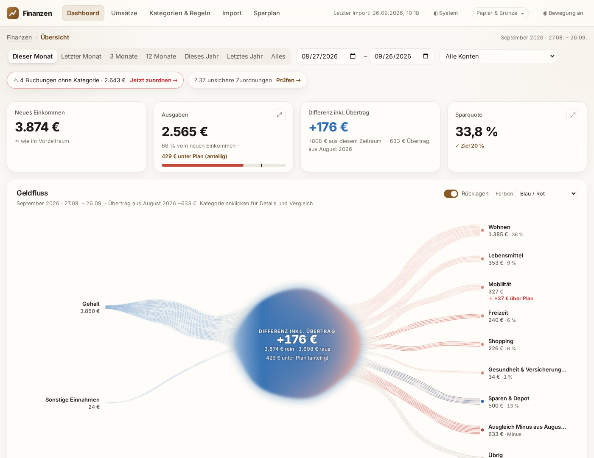
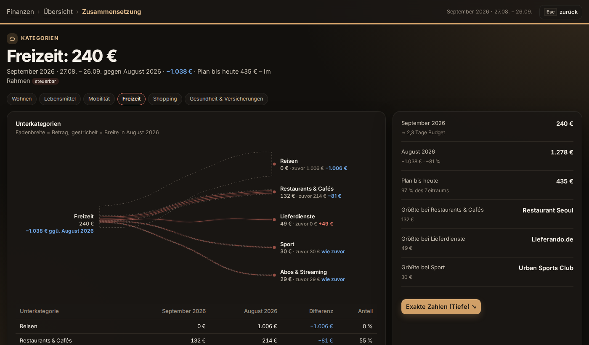
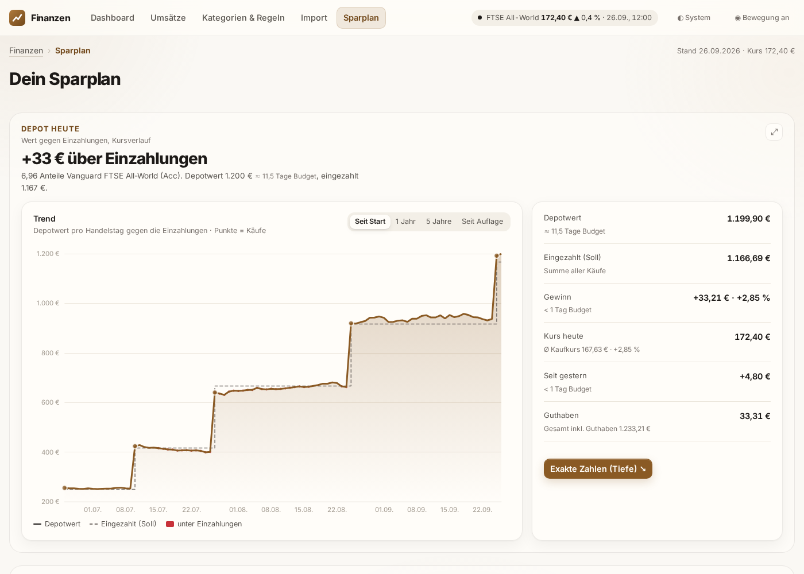
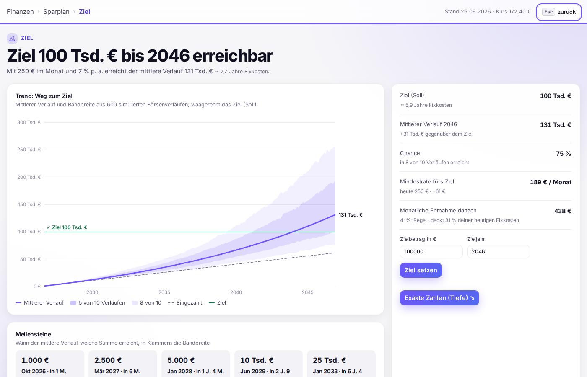

# Finanzen – dein persönliches Finanz-Dashboard

Lokale Web-App, die deine Kontoumsätze aus CSV-Exporten der Banking-App einliest, sie über **frei definierbare
Kategorien und Regeln** automatisch zuordnet und alles in **Dashboards** darstellt. Neue Exporte werden
**kontinuierlich und automatisch** übernommen, auf Wunsch über ein PowerShell-Skript, das deinen Download-Ordner überwacht.



**Datenschutz:** Alles läuft auf deinem Rechner. Der Server lauscht nur auf `127.0.0.1`, die Daten liegen in einer
SQLite-Datei unter `data/`, und es gibt keine Cloud und kein Tracking. Die Diagrammbibliothek (ECharts), die
Animationsbibliothek (Motion) und die Schrift (Inter) sind mitgeliefert, die App funktioniert also auch offline.

## Schnellstart (Windows)

1. **Python 3.9+** installieren, falls noch nicht vorhanden: `winget install Python.Python.3.12`
   Es werden keine weiteren Pakete benötigt, die App nutzt nur die Python-Standardbibliothek.
2. Doppelklick auf **`Finanzen starten.cmd`**. Das Dashboard öffnet sich unter <http://localhost:8765/>.
3. Einen CSV-Export deiner Bank unter **Import** per Drag & Drop hineinziehen.

Zum Ausprobieren mit Demo-Daten (ein Jahr fiktiver Umsätze im DKB- und ING-Format):

```powershell
python scripts\demo_daten.py inbox     # legt die Dateien in die Inbox, die App importiert sie automatisch
```

## Schnellstart (Mac)

1. **Terminal** öffnen (Programme → Dienstprogramme) und prüfen, ob Python da ist: `python3 --version`.
   Fragt macOS nach den „Command Line Developer Tools“, auf *Installieren* klicken. Damit kommen Python und git.
2. Projekt holen und starten:
   ```bash
   git clone https://github.com/davidjost77-blip/whatisthat.git ~/Finanzen
   cd ~/Finanzen
   git checkout claude/finance-tracking-dashboards-eb5ls8
   python3 -m finanzen --open
   ```
3. Später reicht ein Doppelklick auf **`Finanzen starten.command`** im Ordner `~/Finanzen`. Das Terminal-Fenster
   muss offen bleiben, solange du die App nutzt. Beenden mit `Ctrl+C` oder durch Schließen des Fensters.

Bank-Exporte importierst du per Drag & Drop unter *Import* oder indem du sie in `~/Finanzen/inbox` legst.

## Bankanbindung (live, über Enable Banking)

Statt CSV-Exporte zu ziehen, kann die App neue Buchungen direkt von der Bank holen – über
[Enable Banking](https://enablebanking.com), einen regulierten PSD2-Kontoinformationsdienst (rund 2.500 Banken in Europa,
u. a. DKB, ING, Sparkassen). Für die **eigenen Konten** ist das kostenlos („eingeschränkter Modus“).

1. Bei enablebanking.com registrieren, im Control Panel eine Anwendung anlegen: Umgebung **Production**,
   Redirect URL `https://localhost:8765/bank/callback`, Schlüssel erzeugen lassen (`.pem` wird heruntergeladen).
2. Anwendung mit **„Activate by linking accounts“** aktivieren und die eigenen Konten verknüpfen.
3. In der App unter **Import → Bankanbindung** Application-ID und `.pem` hinterlegen, Bank wählen, **Bei Bank anmelden**.
4. Nach der Anmeldung zeigt der Browser eine Seite, die nicht lädt (`https://localhost…?code=…`) – die komplette Adresse
   kopieren und in der App einfügen. Fertig: Die letzten Monate werden sofort übernommen.

Danach ruft die App **alle 6 Stunden** automatisch ab (PSD2 erlaubt 4 Abrufe am Tag ohne dich), solange sie läuft;
„Jetzt abrufen“ geht jederzeit. Das geöffnete Dashboard aktualisiert sich von selbst. Die Freigabe gilt je nach Bank
90–180 Tage, danach einmal „Neu freigeben“. Deine Bank-Zugangsdaten sieht weder die App noch Enable Banking; der
private Schlüssel liegt nur lokal unter `data/bank/`. Duplikate zu früheren CSV-Importen werden erkannt, vorgemerkte
Umsätze erst nach der Buchung übernommen.

## Kontinuierlicher Import

Es gibt drei Wege, die du beliebig kombinieren kannst:

| Weg | Wie | Wofür |
|---|---|---|
| **Inbox-Ordner** | Datei in `inbox/` legen | Die App prüft den Ordner alle 10 s, importiert neue Dateien und verschiebt sie nach `inbox/verarbeitet/` (bzw. `inbox/fehler/`). |
| **PowerShell-Watcher** | `scripts\Watch-BankExports.ps1` | Überwacht z. B. `Downloads` auf neue Bank-Exporte und schickt sie per HTTP an die App. Wenn die App gerade nicht läuft, legt er die Datei in die Inbox. |
| **Web-Oberfläche** | Drag & Drop unter *Import* | Für den einzelnen Export zwischendurch |

### Watcher einrichten

```powershell
# einmalig testen (läuft im Vordergrund, Strg+C beendet)
.\scripts\Watch-BankExports.ps1 -Folder "$HOME\Downloads"

# dauerhaft: App + Watcher starten bei jeder Anmeldung unsichtbar im Hintergrund
.\scripts\Install-AutoStart.ps1                      # Standard: Downloads-Ordner
.\scripts\Install-AutoStart.ps1 -Folder "D:\Bank"    # anderer Ordner
.\scripts\Install-AutoStart.ps1 -Uninstall           # wieder entfernen
```

Wichtige Parameter von `Watch-BankExports.ps1`:

- `-Pattern`: regulärer Ausdruck für Dateinamen. Der Standard erkennt typische Namen wie `…Umsatzliste…` (DKB),
  `Umsatzanzeige…` (ING), `…umsatz.CSV` (Sparkasse), `n26-csv-transactions…`, `account-statement…` (Revolut)
  und `…Kontoauszug…`. Mit `-Pattern '\.csv$'` wird jede CSV-Datei importiert.
- `-AfterImport Keep|Move|Delete`: was nach dem Import mit der Datei passiert. Standard ist `Move` in den Unterordner `importiert\`.
- `-Once`: einmal prüfen und beenden, z. B. für eine eigene geplante Aufgabe.

Falls PowerShell die Skripte blockiert: `Set-ExecutionPolicy -Scope CurrentUser RemoteSigned`.

**Überlappende Exporte sind kein Problem.** Jede Buchung bekommt einen Fingerabdruck aus Konto, Datum, Betrag,
Gegenpartei und Verwendungszweck, und Duplikate werden übersprungen. Du kannst also z. B. jede Woche „die letzten 90 Tage“
exportieren. Vorgemerkte Buchungen (Status *vorgemerkt/pending*) werden ignoriert und erst übernommen, wenn sie gebucht sind.

## Unterstützte Formate

Spalten, Trennzeichen (`;` `,` Tab), Zeichensatz (UTF-8/Windows-1252), Datums- und Zahlenformat (`1.234,56` / `1,234.56`)
sowie Metadatenzeilen über der Kopfzeile werden automatisch erkannt. Mit Beispieldateien getestet sind
**DKB (Girokonto und Visa-Kreditkarte), ING, Sparkasse (CAMT-CSV), N26, Revolut** und Dateien mit getrennten **Soll/Haben-Spalten**.
PayPal- und Klarna-Zahlungen werden dem eigentlichen Händler zugeordnet („Ihr Einkauf bei Wolt“ → *Wolt*), und der
Kreditkartenausgleich zählt als Umbuchung statt als Einnahme. Volksbank, comdirect,
Commerzbank, Postbank u. a. werden über dieselben Spaltennamen erkannt, sind aber nicht mit echten Exporten getestet.

Wird deine Bank nicht erkannt, lege ein eigenes Profil an: `profiles.example.json` nach `profiles.json` kopieren und
die Spaltennamen deiner Datei eintragen. Verfügbare Felder: `date`, `amount` (oder `debit` + `credit`), `counterparty`
(oder `payee`/`payer`), `purpose`, `booking_text`, `iban`, `currency`, `status`, `account`.

## Kategorien & Regeln

- **Kategorien** sind frei definierbar, mit einer Ebene Unterkategorien, einer Farbe und einem optionalen **Monatsbudget**.
  Jede Oberkategorie hat eine Art:
  - *Ausgabe* oder *Einnahme*
  - *Umbuchung*: zählt weder als Einnahme noch als Ausgabe, z. B. Sparplan, Tagesgeld oder Überweisung aufs eigene Konto
- **Regeln** ordnen Buchungen automatisch zu: *wenn Empfänger/Zweck/Buchungstext/IBAN enthält … (oder Regex), nur Ausgaben,
  Betrag zwischen …, dann Kategorie X*. Die erste passende Regel (nach Priorität) gewinnt. Im Regel-Dialog siehst du live,
  welche Buchungen passen würden.
- **Schnell zuordnen** (oben unter *Umsätze*): Unkategorisierte Buchungen werden nach Empfänger gruppiert, auch
  über Schreibvarianten hinweg („Karl August GmbH“ ≈ „Karl.August.GmbH/Nuernberg“). Eine Auswahl ordnet die ganze
  Gruppe zu und legt dafür eine Regel an, die auch für alle künftigen Importe gilt.
- Überweisungen auf eigene Konten werden am Namen des Kontoinhabers erkannt und zählen als Umbuchung.
- Unter **Umsätze** kannst du jede Buchung von Hand umkategorisieren, auch mehrere auf einmal. Danach bietet die App an,
  daraus direkt eine Regel zu machen. Von Hand gesetzte Kategorien werden von Regeln nie überschrieben.
- Rückerstattungen in einer Ausgabenkategorie (z. B. Amazon-Retoure) verringern die Ausgaben dieser Kategorie.

Beim ersten Start wird ein Satz typischer deutscher Kategorien samt Regeln angelegt (Supermärkte, Tankstellen,
Streaming, Versicherungen …) und für vier Kategorien ein Beispiel-Budget gesetzt. Alles davon kannst du ändern oder löschen.

### Monatsplan: ein Sparziel, Budgets im Verhältnis

Oben unter *Kategorien & Regeln*: Du setzt **ein Sparziel pro Monat** (in % des Ø Einkommens der letzten 6 Monate).
Der Rest ist dein Ausgabenrahmen, verteilt auf die Kategorien. Verschiebst du das Ziel, passen sich alle nicht
gesperrten Budgets im Verhältnis an; verschiebst du ein Budget, gleichen die übrigen nicht gesperrten es aus.
Fixkosten sind standardmäßig **gesperrt**. **Steuerbar** markiert Kategorien, die du direkt beeinflussen kannst
(Standard Freizeit, Shopping) – sie erscheinen im Geldfluss im tieferen Ton. Änderungen werden sofort gespeichert.

### Monate = Gehaltsmonate, Startseite = laufender Monat

Die Startseite zeigt den **laufenden Monat** („Dieser Monat“). Ein Monat reicht immer **vom Gehaltseingang bis
unmittelbar vor den nächsten** – das Gehalt ist der erste Eintrag des Monats. Erkannt wird das Gehalt über die
Kategorie „Gehalt“; Sonderzahlungen (Weihnachtsgeld, Korrekturen) starten keinen neuen Monat. Benannt wird ein
Gehaltsmonat nach dem Kalendermonat, in dem die meisten seiner Tage liegen (Gehalt am 27.08. → „September“). Der
laufende Monat endet am Tag vor dem erwarteten nächsten Gehalt. Alle Monatswerte – Soll, Budgets, Ø 6 Monate,
Monatsverlauf, Vergleich mit dem Vormonat – rechnen in Gehaltsmonaten. Ohne erkennbares Gehalt gelten Kalendermonate.

### Zuordnen – ohne Kategorie und unsicher

Über den Kennzahlen im Dashboard erscheint ein Hinweis, sobald etwas offen ist („⚠ 3 Buchungen ohne Kategorie“,
„? 12 unsichere Zuordnungen“); auch „Nicht kategorisiert“ im Geldfluss ist anklickbar. Ein Klick öffnet ein kompaktes
Panel: eine Karte nach der anderen, größter Betrag zuerst, gruppiert nach Empfänger.

- **Enter** übernimmt den Vorschlag (aus früheren Zuordnungen ähnlicher Empfänger), **1–8** die häufigsten Kategorien,
  Suchfeld für alle anderen, **+ Neu** legt eine Kategorie an. **S/→** überspringt, **←** zurück, **Esc** schließt.
- Jede Entscheidung gilt für **alle ähnlichen** Buchungen – auch künftige (es wird eine Regel am Empfänger angelegt).
  „Rückgängig“ im Hinweis macht Zuordnung und Regel vollständig rückgängig.
- **Unsicher** markiert die App automatische Zuordnungen, wenn mehrere Regeln verschiedener Kategorien passen, wenn
  nur der Verwendungszweck (nicht der Empfänger) passte oder wenn der Betrag weit über dem Üblichen des Empfängers
  liegt. „Passt so“ bestätigt und merkt es sich; eine andere Kategorie korrigiert alle ähnlichen.

## Dashboards

Gestaltet nach **[DESIGN.md](DESIGN.md)** (verbindlich, Stand 8): wählbares Farbschema (Standard „Papier & Bronze“, dazu Tinte, Graphit, Salbei), Geldfluss als See mit feinen Fäden,
Rot nur für Warnungen, Schrift Inter, Umschalter Hell/Dunkel/System, Bewegung in allen Teilen, jede Zahl mit Soll-Wert
und Alltagsäquivalent.

Die Startseite zeigt alles auf einen Blick, geordnet nach Wichtigkeit, und folgt der Filterleiste (Zeitraum, Konto):

1. **Kennzahlen**: neues Einkommen, Ausgaben (Anteil vom neuen Einkommen, gegen den anteiligen Plan), Differenz
   (mit eingeschalteten Rücklagen inkl. Übertrag aus dem Vergleichszeitraum), Sparquote (gegen dein Sparziel)
2. **Geldfluss** im Zentrum: links die Einnahmen in der Einnahmenfarbe, rechts Kategorien, „Sparen & Depot“ und
   „Übrig“ in der Ausgabenfarbe; steuerbare Kategorien im tieferen Ton. Der See zeigt rein, raus und die Differenz und
   färbt sich nach dem Abstand zum anteiligen Plan (je kräftiger, desto weiter weg). Der Schalter **Rücklagen** holt
   den Übertrag aus dem Vergleichszeitraum dazu – ein Plus fließt blau zu, ein Minus rot ab. Das **Farbpaar** (Blau/Rot,
   Petrol/Koralle, Salbei/Terrakotta) wählst du im Geldfluss. Rot gewarnt wird nur ab 100 € Kategoriesumme.
   **Klick auf eine Kategorie** öffnet ihr Unterdashboard: Unterkategorien gegen den Vergleichszeitraum (Vormonat;
   beim laufenden Jahr derselbe Zeitraum im Vorjahr).
3. **Kategorien gegen Soll** (Budget bzw. Ø der letzten 6 Monate) und **Depot & Sparplan**
4. **Einnahmen & Ausgaben pro Monat**
5. **Größte Ausgaben** und **Top-Empfänger**

**⤢** öffnet Karten im Vollbild (Trend, Vergleich, exakte Tabellen), <kbd>Esc</kbd> geht zurück. Die Maßstäbe
(Monats-Soll, Fixkosten, Sparquote-Soll) stellst du im Vollbild „Ausgaben“ unter *Exakte Zahlen* ein; welche Kategorien
Fixkosten sind, im Kategorie-Dialog.




## Sparplan & ETF-Projektion

Unter **Sparplan** (<http://localhost:8765/sparplan.html>) bildet die App deinen ETF-Sparplan ab. Vorbelegt ist der laufende
Plan: 250 € monatlich in den **Vanguard FTSE All-World (Acc)** (VWCE, IE00BK5BQT80) mit den bisherigen Käufen.

Die Sparplan-Seite ist eine durchgehende Seite: Depot heute, Sparplan-Takt, Was wäre wenn, Ziel, Käufe & Abgleich.
Jeder Abschnitt lässt sich per ⤢ im Vollbild öffnen.



- **Depot heute**: Wert gegen Einzahlungen. Im Fokus Depotwert pro Handelstag, Kursverlauf (1 Jahr, 5 Jahre, seit
  Auflage) gegen deinen Ø Kaufkurs. In der Tiefe alle Käufe.
- **Automatische Sparplan-Buchung**: Jeden Monat am Ausführungstag (bzw. am nächsten Handelstag) bucht die App die
  Rate selbst, zum Schlusskurs dieses Tages. Ein Import von Kontoauszügen ist dafür nicht nötig. Die Stückzahl ist als
  *geschätzt* markiert, bis du den Kauf per Klick mit der Abrechnung bestätigst. Rate, Ausführungstag und Pause stellst
  du unter *Sparplan-Takt → Käufe* ein. Einmalkäufe verschieben nichts, eine von Hand eingetragene Rate wird nicht doppelt
  gebucht, und der Regler unter *Was wäre wenn* ändert nur die Projektion, nie den echten Plan.
- **Sparplan-Takt**: eine Perle pro Monat, gefüllt = Kauf erfasst. Farbig wird es, wenn eine fällige Rate fehlt oder
  der Kontoauszug nicht zu den erfassten Käufen passt. In der Tiefe Käufe, Guthaben und Kontoauszug.
- **Ziel** (Standard 100.000 € in 20 Jahren, im Fokus änderbar): mittlerer Verlauf gegen das Ziel, Chance in x von 10
  Verläufen, nötige Monatsrate, Meilensteine und monatliche Entnahme als Anteil deiner Fixkosten.
- **Was wäre wenn**: Sparrate, Laufzeit, jährliche Erhöhung, Rendite, Schwankung, Kosten, Inflation, Steuern
  (vereinfacht) und Sonderzahlungen per Regler. Die Projektion zeigt mittleren Verlauf und Bandbreite aus 600 simulierten
  Börsenverläufen, dazu drei Szenarien (4 / 7 / 9 % p. a.) und den **ETF-Baukasten**, in dem du weitere ETFs
  hypothetisch dazunimmst (MSCI World, Schwellenländer, S&P 500, Nasdaq 100, Small Cap Value, Technologie, Gold,
  Geldmarkt oder frei gesucht).
- **Live-Kurse** kommen über den lokalen Server von Yahoo Finance (Xetra, verzögert), werden in der Datenbank
  zwischengespeichert und jede Minute aktualisiert. Ohne Internet rechnet die App mit dem letzten gespeicherten Stand
  bzw. dem letzten Kaufkurs.



Alle Einstellungen werden automatisch gespeichert. Die Projektion ist eine Modellrechnung, keine Prognose.

## Weitere Optionen

```text
python -m finanzen --help
  --port 8765            Port
  --db data\finanzen.db  Datenbankdatei (z. B. in einen verschlüsselten Ordner legen)
  --inbox inbox          überwachter Ordner
  --no-watch             Inbox nicht überwachen
  --import DATEI …       Dateien einmalig importieren und beenden
```

Unter *Import* lassen sich alle Buchungen als CSV für Excel exportieren und einzelne Importe rückgängig machen.
Für eine **Sicherung** genügt es, `data\finanzen.db` zu kopieren.

## Entwicklung

```text
finanzen/
  importer.py   CSV-Erkennung und Parsing (Bankformate, Zahlen, Datumsangaben)
  ingest.py     Import in die DB und Überwachung des Inbox-Ordners
  rules.py      Regel-Engine
  analytics.py  Aggregationen für die Dashboards
  depot.py      ETF-Depot, Sparplan-Einstellungen, Kursabruf mit Zwischenspeicher
  server.py     JSON-API und Auslieferung der Oberfläche
  static/       Web-Oberfläche (HTML/CSS/JS, ECharts, Motion)
                ui-core.js = Zoomstufen, Breadcrumb, Esc, Äquivalente · sparplan-model.js = Projektion
DESIGN.md       verbindliche Gestaltungsregeln
scripts/        PowerShell-Watcher, Autostart, Demo-Daten
tests/          python -m unittest discover -s tests
```
